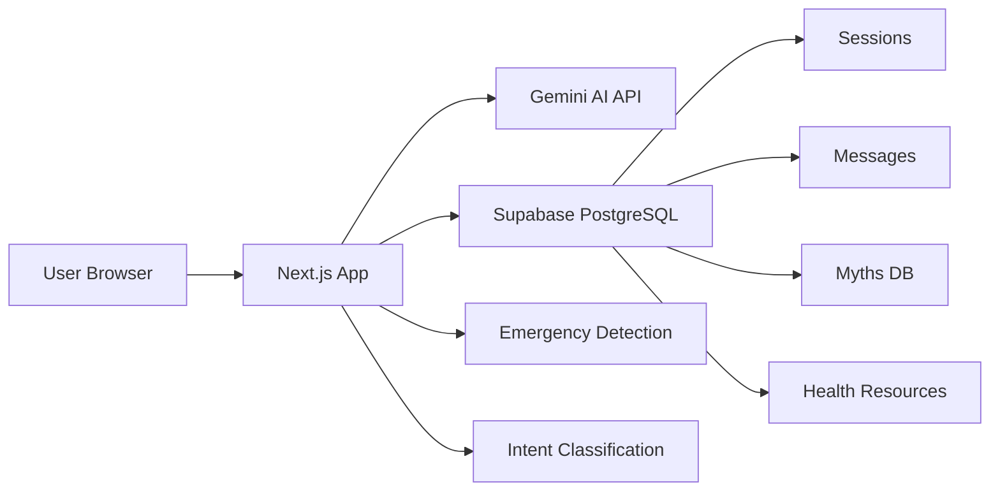

# 🌿 ArogyaBot — AI-Powered Public Health Awareness Chatbot

**Verified Health. Zero Misinformation. Every Language.**

ArogyaBot is a multilingual, AI-driven public health chatbot that delivers verified health information from WHO, CDC, and MoHFW. It proactively detects and counters health misinformation, provides context-aware local healthcare recommendations, and supports 8 Indian regional languages.

> ⚕️ **Medical Disclaimer:** ArogyaBot is not a substitute for professional medical advice, diagnosis, or treatment. Always consult a qualified healthcare professional for medical concerns.

---

## 🏗️ Architecture



### Core Modules

| Module | Name | Purpose |
|--------|------|---------|
| **VIR** | Verified Information Retrieval | All health info sourced from WHO/CDC/MoHFW only |
| **PMC** | Proactive Misinformation Countermeasure | Detects and corrects health myths in real-time |
| **CARE** | Context-Aware Recommendations | Location-based hospital and helpline suggestions |
| **EMERGENCY** | Immediate Escalation | Detects life-threatening keywords → instant helpline response |

---

## 🚀 Quick Start

### Prerequisites

- Node.js 18+
- npm
- A Google Gemini API key (free)
- A Supabase project (free tier)

### 1. Clone the Repository

```bash
git clone <your-repo-url>
cd arogyabot
```

### 2. Install Dependencies

```bash
npm install
```

### 3. Get a Free Gemini API Key

1. Go to [aistudio.google.com](https://aistudio.google.com/app/apikey)
2. Sign in with your Google account
3. Click **"Get API Key"** → **"Create API Key"**
4. Copy the key

### 4. Set Up Supabase

1. Go to [supabase.com](https://supabase.com) and create a free project
2. Go to **SQL Editor** and run these three migration files in order:
   - `supabase/migrations/001_init_schema.sql`
   - `supabase/migrations/002_rls_policies.sql`
   - `supabase/migrations/003_seed_myths.sql`
3. Go to **Settings → API** and copy:
   - Project URL
   - `anon` public key
   - `service_role` key (keep this secret!)

### 5. Configure Environment Variables

```bash
cp .env.local.example .env.local
```

Edit `.env.local` and fill in your keys:

```env
GEMINI_API_KEY=your_gemini_api_key_here
NEXT_PUBLIC_SUPABASE_URL=https://your-project.supabase.co
NEXT_PUBLIC_SUPABASE_ANON_KEY=your_anon_key_here
SUPABASE_SERVICE_ROLE_KEY=your_service_role_key_here
```

### 6. Run the Development Server

```bash
npm run dev
```

Open [http://localhost:3000](http://localhost:3000) — you'll see the chat immediately.

---

## 🌐 Environment Variables

| Variable | Description | Required | Exposed to Client |
|----------|-------------|----------|-------------------|
| `GEMINI_API_KEY` | Google Gemini API key | ✅ | ❌ |
| `NEXT_PUBLIC_SUPABASE_URL` | Supabase project URL | ✅ | ✅ |
| `NEXT_PUBLIC_SUPABASE_ANON_KEY` | Supabase anon/public key | ✅ | ✅ |
| `SUPABASE_SERVICE_ROLE_KEY` | Supabase service role key | ✅ | ❌ |
| `NEXT_PUBLIC_APP_URL` | App URL (default: localhost:3000) | ❌ | ✅ |
| `NEXT_PUBLIC_DEFAULT_LANGUAGE` | Default language code | ❌ | ✅ |

---

## 🔐 Anonymous Sessions

ArogyaBot uses **zero-friction anonymous sessions**:

- **No login.** No signup. No authentication of any kind.
- On first visit, a UUID is generated and stored in `localStorage`
- This UUID identifies the session in Supabase for message logging
- Chat history persists across page refreshes via `localStorage`
- "Clear Chat" generates a new UUID → fresh conversation
- Old conversations are preserved in Supabase for analytics

---

## 🌍 Supported Languages

| Code | Language | Native Name |
|------|----------|-------------|
| `en` | English | English |
| `hi` | Hindi | हिंदी |
| `ta` | Tamil | தமிழ் |
| `bn` | Bengali | বাংলা |
| `mr` | Marathi | मराठी |
| `te` | Telugu | తెలుగు |
| `kn` | Kannada | ಕನ್ನಡ |
| `gu` | Gujarati | ગુજરાતી |

---

## 📁 Project Structure

```
arogyabot/
├── app/
│   ├── api/
│   │   ├── chat/route.ts         # Core Gemini AI streaming route
│   │   ├── location/route.ts     # CARE module — hospital lookup
│   │   └── log/route.ts          # Anonymous session logger
│   ├── layout.tsx                # Root layout
│   ├── page.tsx                  # Chat = Homepage
│   └── globals.css               # Global styles
├── components/
│   ├── chat/                     # All chat UI components
│   └── layout/                   # Navbar
├── lib/
│   ├── ai/                       # Gemini, prompts, classifier, emergency
│   ├── constants/                # Languages, helplines, sources
│   ├── supabase/                 # Client + server clients
│   ├── session.ts                # Anonymous session management
│   └── utils.ts                  # Shared utilities
├── hooks/                        # React hooks
├── store/                        # Zustand chat store
├── types/                        # TypeScript interfaces
└── supabase/migrations/          # Database schema + seeds
```

---

## 🚀 Vercel Deployment

1. Push your code to GitHub
2. Go to [vercel.com](https://vercel.com) and import the repository
3. Set environment variables in Vercel dashboard:
   - `GEMINI_API_KEY`
   - `NEXT_PUBLIC_SUPABASE_URL`
   - `NEXT_PUBLIC_SUPABASE_ANON_KEY`
   - `SUPABASE_SERVICE_ROLE_KEY`
4. Deploy! 🎉

The `vercel.json` is configured to deploy to the Mumbai (`bom1`) region for lowest latency in India.

---

## 🤝 Contributing

1. Fork the repository
2. Create a feature branch: `git checkout -b feature/your-feature`
3. Commit your changes: `git commit -m 'Add some feature'`
4. Push to the branch: `git push origin feature/your-feature`
5. Open a Pull Request

---

## 📄 License

This project is licensed under the MIT License.

---

## ⚕️ Medical Disclaimer

ArogyaBot is an **awareness and information tool**, not a diagnostic or treatment system.

- It does NOT diagnose diseases
- It does NOT prescribe medications
- It does NOT replace professional medical advice
- Always consult a qualified healthcare professional for medical concerns

**In case of emergency, call 108 (Ambulance) or 112 (Emergency) immediately.**

---

Built with ❤️ for public health awareness in India.
